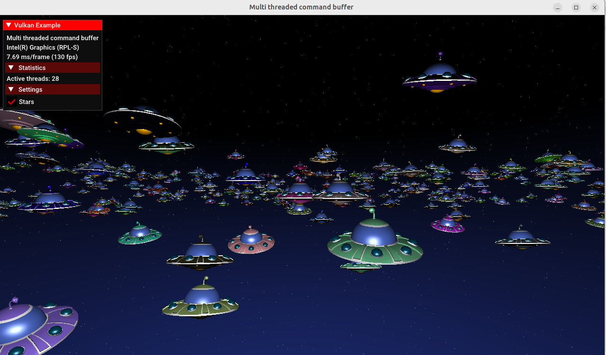

# Vulkan Multithreaded Command Buffer Rendering

This project demonstrates a Vulkan rendering example focused on **multithreaded command buffer generation**. It renders multiple animated UFO objects in a 3D scene using a glTF model, a star sphere background, Vulkan graphics pipelines, and secondary command buffers recorded across multiple CPU threads.

The goal of this project was to understand how Vulkan exposes the rendering process at a lower level, especially concepts such as:

- glTF asset loading
- vertex and index buffers
- graphics pipeline creation
- push constants
- model-view-projection transformations
- primary and secondary command buffers
- multithreaded command recording
- frustum culling

---

## Demo Overview

The scene renders hundreds of UFO objects in a star field. The UFO model is loaded from a `.gltf` asset and reused many times with different positions, rotations, scales, and colors.

The sample also displays a UI overlay showing runtime information such as frame time and the number of active CPU threads.

---

## Motivation

Unlike higher-level graphics engines, Vulkan makes the rendering process explicit. This project was used to understand how a 3D model moves through the Vulkan rendering pipeline:

```text
glTF model
→ vertex and index buffers
→ graphics pipeline
→ command buffer recording
→ draw call
→ final rendered scene
```
---
## Output



---

## Video Explanation

https://github.com/user-attachments/assets/e8dd38f4-c4a7-4801-8987-3a6422b023a2


